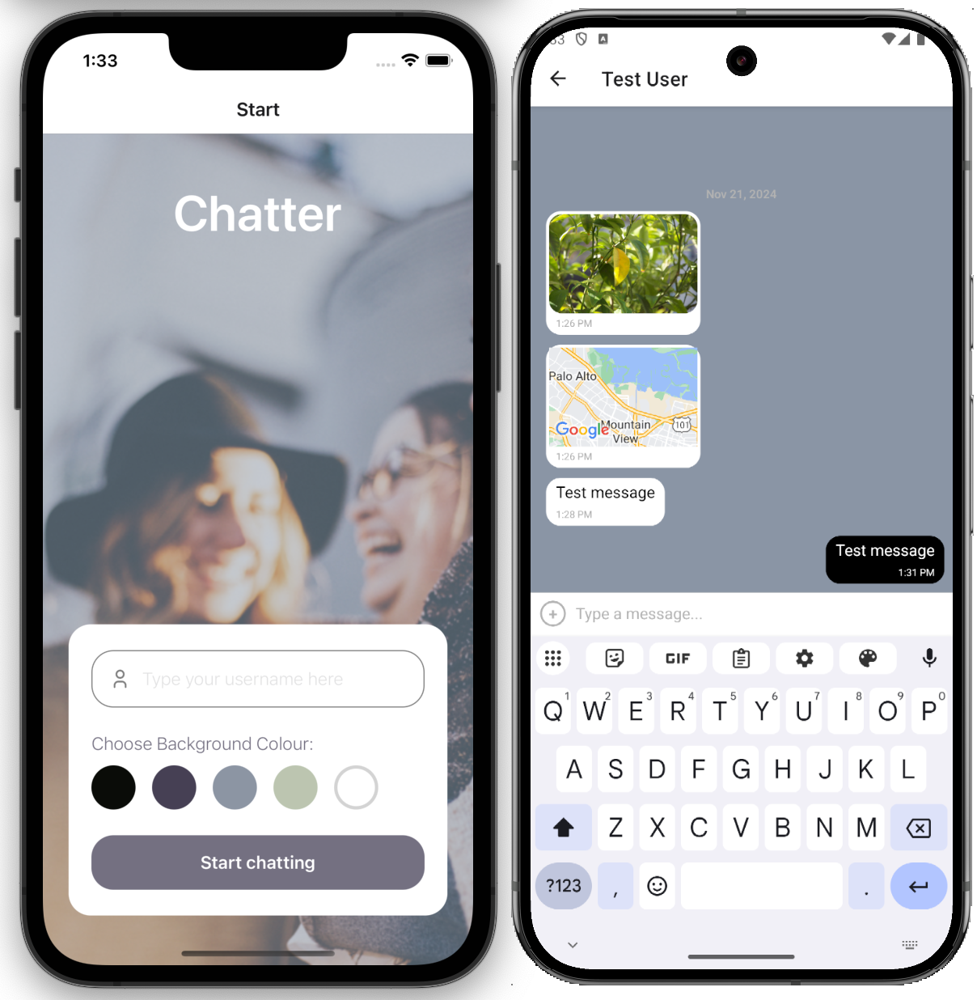

# Chatter

Chatter is a real-time mobile chat app built to run on both iOS and Android devices.



## Features:

- Real-time messaging
- Image Sharing (Uploaded from the user's gallery or taken with the device's camera)
- Location Sharing
- Offline access to (cached) messages

## Technologies Used

- React Native
- GiftedChat
- Firebase for backend storage
- Expo as development platform
- Android Studio Emulator for testing
- AsyncStorage for caching

## Setup Instructions

You can follow these steps to set up the project locally:

1. **Clone the repository:**

   ```bash
   git clone https://github.com/NIER-BIAN/Chatter.git
   cd Chatter
   ```

2. **Install dependencies:**

   (This project was built to work with Node.js v16.19.0.)

   ```bash
   npm install
   ```

   Install Expo CLI:

   ```bash
   npm install -g expo-cli
   ```

3. **Configure Firebase:**

   Create a new project with Firebase Console. Via the "Rules" tab on the Firestore dashboard, change its default configuration so the database allows read-and-write queries from a mobile or web app i.e. change `false` to `true` in line 5 on the document displayed. Under Build → Authentication on the left-hand menu, ensure that anonymous authentication is enabled. Register your web app to generate configurations, then place your credentials in a local config.json file with the following content:
   
   ```
   {
     "apiKey": "YOUR_API_KEY",
     "authDomain": "YOUR_AUTH_DOMAIN",
     "projectId": "YOUR_PROJECT_ID",
     "storageBucket": "YOUR_STORAGE_BUCKET",
     "messagingSenderId": "YOUR_MESSAGING_SENDER_ID",
     "appId": "YOUR_APP_ID"
   }
   ```
  
4. **Run the app locally:**

   ```bash
   npm run start
   ```

5. Set up  Expo-Go on your own mobile device or a virtual device via Android Studio.

---

中甴曱甲串申由田㗊𣊫㽬